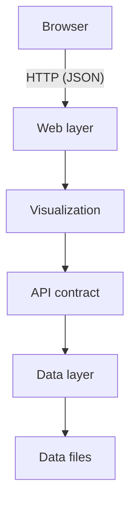
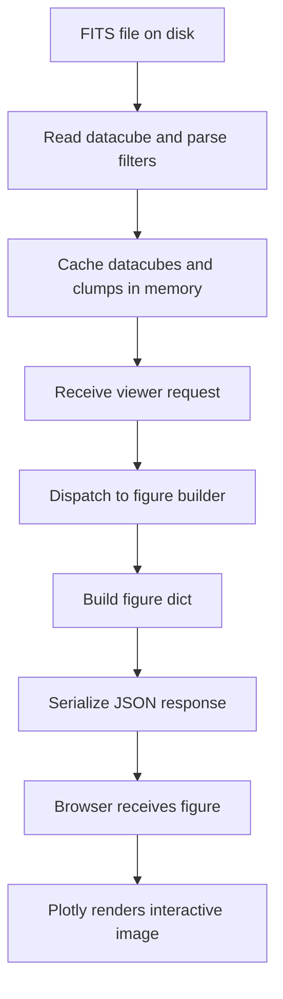
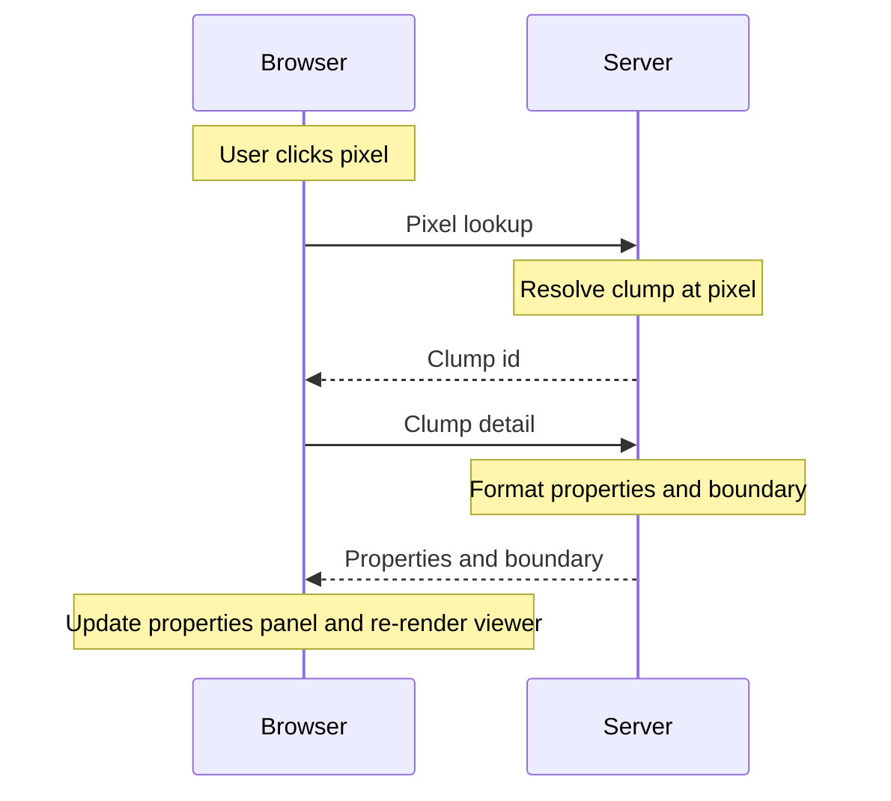
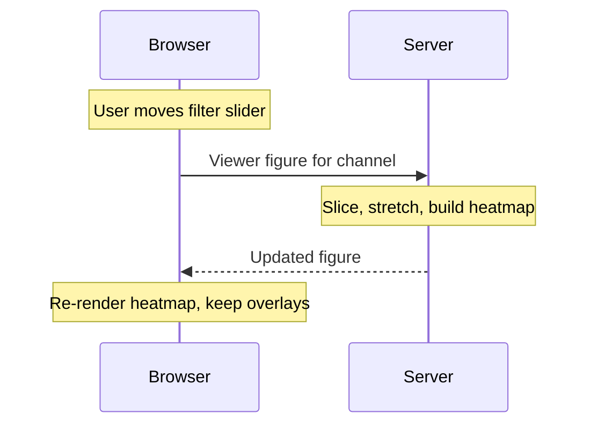
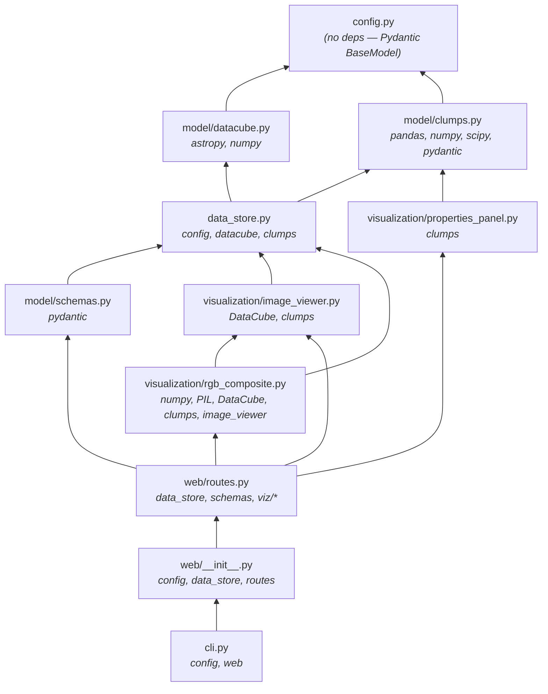

# Architecture

This document describes the overall architecture of Jellyscope, how data flows through the system, and the key technical decisions behind the design.

## Layer Diagram

Jellyscope follows a layered architecture where each layer only depends on layers below it:



## Data Flow: From FITS to Browser

This is the complete path that data travels from a FITS file on disk to a pixel rendered in the user's browser:



## User Interaction Flows

### Flow 1: Click on a Clump

When the user clicks on the galaxy image and hits a pixel that belongs to a clump:



### Flow 2: Change Filter (Slider)



## Key Technical Decisions

### 1. Log Stretch for Image Display

**Problem**: Astronomical images have extreme dynamic range. Raw pixel values span several orders of magnitude, so a linear colormap shows only the brightest features.

**Solution**: Apply `LogStretch(a=200)` from astropy after normalizing to the [10th, 99.98th] percentile range. The `_log_stretch` function uses `AsymmetricPercentileInterval` for robust bounds and maps `f(x) = log(a*x + 1) / log(a + 1)`. This more aggressively boosts faint structure than arcsinh stretch.

**Location**: [image_viewer.py](../src/jellyscope/visualization/image_viewer.py)

```python
def _log_stretch(data):
    interval = AsymmetricPercentileInterval(10.0, 99.98)
    vmin, vmax = interval.get_limits(valid)
    normalized = (clipped - vmin) / (vmax - vmin + 1e-10)
    stretch = LogStretch(a=200)
    return stretch(normalized)
```

Alternative stretch functions `_lupton_asinh_stretch` (Lupton-style asinh with `softening=8.0`) and `_power_stretch` (PowerStretch `a=0.5`) are also available.

### 2. O(1) Pixel-to-Clump Lookup with `_clump_map`

**Problem**: When a user clicks on a pixel, we need to instantly determine which clump (if any) it belongs to. Iterating through all 938 pixel entries per click would be slow and inelegant.

**Solution**: Pre-build a 2D integer array `_clump_map` of shape `(ny, nx)` where each cell stores a `clump_id` or `-1`. This gives constant-time pixel-to-clump lookup.

**Location**: [model/clumps.py](../src/jellyscope/data/model/clumps.py)

```python
self._clump_map = np.full((self.ny, self.nx), -1, dtype=np.int32)

def get_clump_id_at_pixel(self, x, y):
    val = self._clump_map[y, x]
    return int(val) if val >= 0 else None
```

**Memory cost**: 221 x 172 x 4 bytes = ~148 KB (trivial).

### 3. NaN Handling: `NaN → None` in JSON

**Problem**: FITS astronomical data commonly has `NaN` values (masked regions, detector gaps). JSON doesn't have a `NaN` type, and Plotly.js needs `null` to render transparent gaps.

**Solution**: Replace `NaN` with Python `None` when serializing data. Use `np.nanmean`/`np.nanstd` for all statistical computations so NaN pixels don't corrupt results.

**Locations**:

- [model/datacube.py](../src/jellyscope/data/model/datacube.py) — `to_json_slice()`
- [image_viewer.py](../src/jellyscope/visualization/image_viewer.py) — heatmap z values

### 4. DataStore Singleton Pattern

**Problem**: Loading datacubes from FITS files takes ~100ms. We don't want to reload on every HTTP request.

**Solution**: The `DataStore` class uses a class-level singleton (`_instance`). It's initialized once during `create_app()` and all requests access the same in-memory data via `DataStore.get()`.

**Location**: [data_store.py](../src/jellyscope/data/data_store.py)

```python
@classmethod
def get(cls, config=None):
    if cls._instance is None:
        if config is None:
            config = JellyscopeConfig()
        cls._instance = cls(config)
    return cls._instance
```

**Trade-off**: This loads all data eagerly (~12MB). For future datasets with many galaxies, this can evolve into lazy-loading with LRU eviction per dataset.

### 5. Server-Side Figure Construction

**Problem**: Should Plotly figures be built on the server (Python) or the client (JavaScript)?

**Decision**: Server-side. The FastAPI API returns complete Plotly figure dicts `{data: [...], layout: {...}}`, and the browser just calls `Plotly.react(element, fig.data, fig.layout)`.

**Rationale**:

- Keeps the JS thin (~250 lines) — no complex data manipulation in the browser
- Python has astropy/numpy for efficient array operations
- The figure dict format is identical whether built in Python or JS
- Enables server-side caching of frequently-requested figures in the future

### 6. ConvexHull for Clump Boundaries

**Problem**: Each clump is defined by a set of pixels. We need clean polygon outlines for rendering as Plotly scatter traces.

**Decision**: Use `scipy.spatial.ConvexHull` to compute the convex hull of each clump's pixel coordinates, then render the hull vertices as a closed polygon.

**Location**: [model/clumps.py](../src/jellyscope/data/model/clumps.py)

**Trade-off**: Convex hulls don't capture concave clump shapes. For small clumps (5-144 pixels in current data), this is visually acceptable. For more complex shapes, this could be replaced with alpha-shapes or contour tracing.

## Datasets

Jellyscope supports multiple datasets in a single deployment. The `DataStore` discovers datasets by scanning subdirectories of `data_dir`:

- **Subdirectory layout** — each subdirectory of `data_dir` containing FITS + CSV files becomes a `Dataset` named after the directory. Example: `data/galaxy_a/` and `data/galaxy_b/` produce datasets `galaxy_a` and `galaxy_b`.
- **Flat layout (backward compat)** — when `data_dir` itself contains FITS/CSV files at the top level, those load as a single dataset named `default`.

Each `Dataset` is a frozen dataclass with:

- `name: str` — the dataset identifier used in URL paths.
- `datacubes: dict[str, DataCube]` — keyed by datacube name (e.g., `nircam`, `nircam_matched`).
- `clumps: ClumpCatalog` — the clump catalog scoped to that dataset.

`DataStore` exposes `list_datasets()`, `get_dataset(name)`, `get_datacube(dataset_name, datacube_name)`, `get_clumps(dataset_name)`, and a `default_dataset` attribute. The first discovered dataset (alphabetically) is the default; the flat-layout `default` dataset is also the default when present.

All API endpoints are namespaced under `/api/datasets/{dataset_name}/...` so multiple datasets can coexist without path collisions. `GET /api/datasets` returns the list and the default.

## Module Dependency Graph



The key insight is that `config.py` and the data layer have zero upward dependencies, making them usable as standalone libraries without the web layer.
